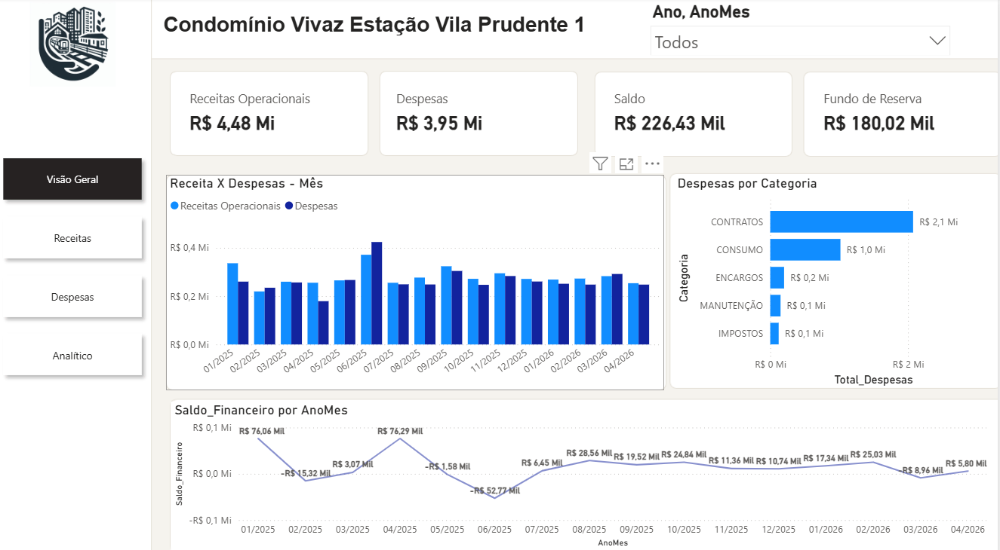
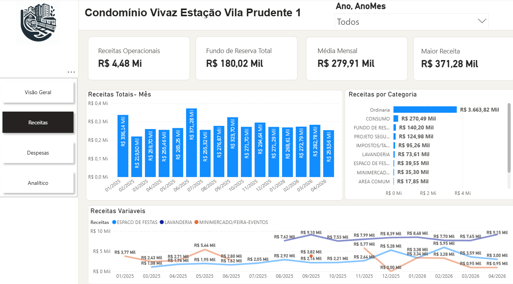
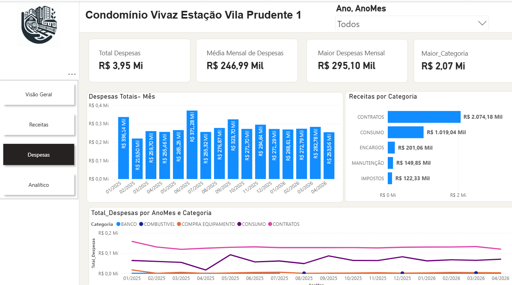
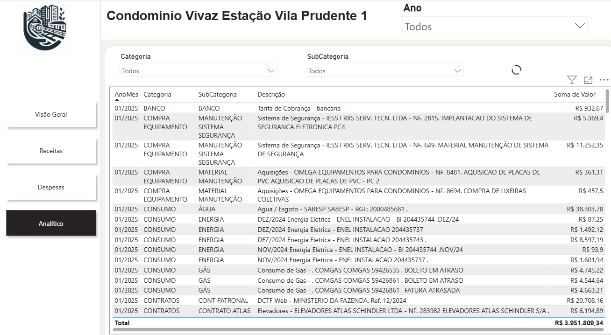

# Dashboard Financeiro Condominial - Power BI

## 📋 Sobre o Projeto

Este projeto foi desenvolvido com o objetivo de analisar e acompanhar a saúde financeira de um condomínio residencial por meio de dashboards interativos no Power BI.

Os dados foram extraídos da plataforma da administradora do condomínio, tratados e modelados utilizando conceitos de Business Intelligence (BI), permitindo o acompanhamento de receitas, despesas, saldo financeiro e consultas analíticas detalhadas.

Além da análise financeira, o projeto foi desenvolvido como parte do meu portfólio profissional na área de Dados, demonstrando conhecimentos em:

- Power BI
- Power Query
- DAX
- Modelagem Dimensional
- Storytelling com Dados
- UX para Dashboards
- Git e GitHub

---

## 🎯 Objetivos do Projeto

- Monitorar receitas e despesas do condomínio.
- Acompanhar a evolução financeira ao longo do tempo.
- Identificar as categorias com maior impacto financeiro.
- Segregar receitas operacionais e fundo de reserva.
- Disponibilizar uma visão executiva e uma visão analítica dos dados.
- Aplicar boas práticas de modelagem dimensional.

---

## 🛠️ Tecnologias Utilizadas

- Power BI Desktop
- Power Query
- DAX
- Excel
- Git
- GitHub

---

## 📂 Estrutura do Projeto

```text
Dashboard_Condominio/
│
├── data/
│   └── Bases de dados utilizadas
│
├── docs/
│   └── Documentação do projeto
│
├── imagens/
│   ├── visao_geral.png
│   ├── receitas.png
│   ├── despesas.png
│   ├── analitico.png
│   └── modelo_dados.png
│
├── powerbi/
│   └── Dashboard_Condominio.pbix
│
├── README.md
└── .gitignore
```

---

## 📊 Modelagem de Dados

O projeto foi estruturado utilizando o modelo dimensional (Star Schema).

### Tabelas Fato

#### fReceitas

| Campo |
|---------|
| data |
| cod_receita |
| Receita |
| tipo |
| valor |

#### fDespesas

| Campo |
|---------|
| data |
| Descrição |
| Valor |
| Tipo |
| Cod_SubCateg |
| Cod_categoria |

---

### Tabelas Dimensão

#### dCalendario

| Campo |
|---------|
| Date |
| Ano |
| Mes |
| MesNum |
| AnoMes |

#### dCod_Categ

| Campo |
|---------|
| Cod_categ |
| Categoria |

#### dCod_SubCat

| Campo |
|---------|
| Cod_SubCat |
| SubCategoria |

#### dTipo

| Campo |
|---------|
| Cod_tipo |
| Descrição |

#### dCod_receitas

| Campo |
|---------|
| Cod_RE |
| Receitas |

---

## 🔗 Relacionamentos

```text
dCalendario[Date] → fReceitas[data]

dCalendario[Date] → fDespesas[data]

dCod_Categ[Cod_categ] → fDespesas[Cod_categoria]

dCod_SubCat[Cod_SubCat] → fDespesas[Cod_SubCateg]

dTipo[Cod_tipo] → fReceitas[tipo]

dTipo[Cod_tipo] → fDespesas[Tipo]

dCod_receitas[Cod_RE] → fReceitas[cod_receita]
```

---

## 🧹 Tratamento dos Dados

Durante a etapa de preparação dos dados foram realizadas as seguintes transformações:

- Remoção de linhas em branco.
- Remoção de colunas desnecessárias.
- Ajuste dos tipos de dados.
- Correção de inconsistências temporais.
- Padronização das categorias e subcategorias.
- Criação das tabelas dimensão.
- Criação da tabela calendário.
- Ajuste dos relacionamentos.
- Validação dos dados financeiros.

---

## 📅 Tabela Calendário

Foi criada uma dimensão calendário para permitir análises temporais adequadas.

### Colunas criadas

```DAX
dCalendario =
ADDCOLUMNS(
    CALENDAR(
        MIN(fReceitas[data]),
        MAX(fReceitas[data])
    ),
    "Ano", YEAR([Date]),
    "Mes", FORMAT([Date],"MMMM"),
    "MesNum", MONTH([Date]),
    "AnoMes", FORMAT([Date],"MM/YYYY")
)
```

A coluna **Mes** foi classificada pela coluna **MesNum** para garantir a ordenação correta dos meses.

---

## 📈 Medidas DAX

### Total Receitas Brutas

```DAX
Total Receitas Brutas =
SUM(fReceitas[valor])
```

---

### Total Receitas Operacionais

Exclui receitas destinadas ao fundo de reserva.

```DAX
Total Receitas Operacionais =
CALCULATE(
    [Total Receitas Brutas],
    NOT(fReceitas[cod_receita] IN {2,11}),
    fReceitas[tipo] = 1
)
```

---

### Fundo de Reserva

```DAX
Fundo_reserva =
CALCULATE(
    SUM(fReceitas[valor]),
    fReceitas[cod_receita] IN {2,11},
    fReceitas[tipo] = 1
)
```

---

### Total Despesas

```DAX
Total_Despesas =
SUM(fDespesas[Valor])
```

---

### Saldo Financeiro

```DAX
Saldo_Financeiro =
[Total Receitas Operacionais] - [Total_Despesas]
```

---

### Média Mensal de Receitas

```DAX
Media_Mensal_Receitas =
AVERAGEX(
    VALUES(dCalendario[AnoMes]),
    [Total Receitas Operacionais]
)
```

---

### Maior Receita Mensal

```DAX
Maior_Receita_Mensal =
MAXX(
    VALUES(dCalendario[AnoMes]),
    [Total Receitas Operacionais]
)
```

---

### Média Mensal de Despesas

```DAX
Media_Mensal_Despesas =
AVERAGEX(
    VALUES(dCalendario[AnoMes]),
    [Total_Despesas]
)
```

---

### Maior Despesa Mensal

```DAX
Maior_Despesa_Mensal =
MAXX(
    VALUES(dCalendario[AnoMes]),
    [Total_Despesas]
)
```

---

## 📑 Estrutura do Dashboard

O dashboard foi dividido em quatro páginas.

---

## 🏠 Página 1 - Visão Geral

Objetivo: fornecer uma visão executiva da situação financeira do condomínio.

### Indicadores

- Receitas Operacionais
- Despesas
- Saldo Financeiro
- Fundo de Reserva

### Visuais

- Receita x Despesa por mês
- Despesas por categoria
- Evolução financeira

### Filtros

- Ano

---

## 💰 Página 2 - Receitas

Objetivo: acompanhar a evolução das receitas.

### Indicadores

- Receitas Operacionais
- Fundo de Reserva
- Média Mensal
- Maior Receita

### Visuais

- Receitas Totais por mês
- Receitas por categoria
- Evolução das receitas variáveis

### Filtros

- Ano

---

## 📉 Página 3 - Despesas

Objetivo: acompanhar e analisar os gastos do condomínio.

### Indicadores

- Total Despesas
- Média Mensal
- Maior Despesa
- Categoria com maior gasto

### Visuais

- Despesas por mês
- Despesas por categoria
- Evolução das principais categorias

### Filtros

- Ano
- Categoria

---

## 🔎 Página 4 - Analítico

Objetivo: consulta detalhada das despesas.

### Filtros

- Ano
- Mês
- Categoria
- SubCategoria

### Tabela

- Ano/Mês
- Categoria
- SubCategoria
- Descrição
- Valor

---

## 📸 Screenshots

### Visão Geral



### Receitas


### Despesas


### Analítico


---

## 💡 Principais Aprendizados

Durante o desenvolvimento deste projeto foram aplicados conceitos de:

- ETL com Power Query
- Modelagem Dimensional
- Criação de medidas DAX
- Desenvolvimento de KPIs
- Storytelling com Dados
- Design de Dashboards
- Governança de Dados
- Versionamento com Git e GitHub

---

## 👨‍💻 Autor

**Dyego Nery Martins Pinheiro**

- LinkedIn: *www.linkedin.com/in/dyego-nery*
- GitHub: *https://github.com/nerydyego/Dashboard_condominio*

---

## 📌 Status do Projeto

✅ Concluído

Projeto desenvolvido para fins de estudo, prática e composição de portfólio profissional em Análise de Dados e Business Intelligence.